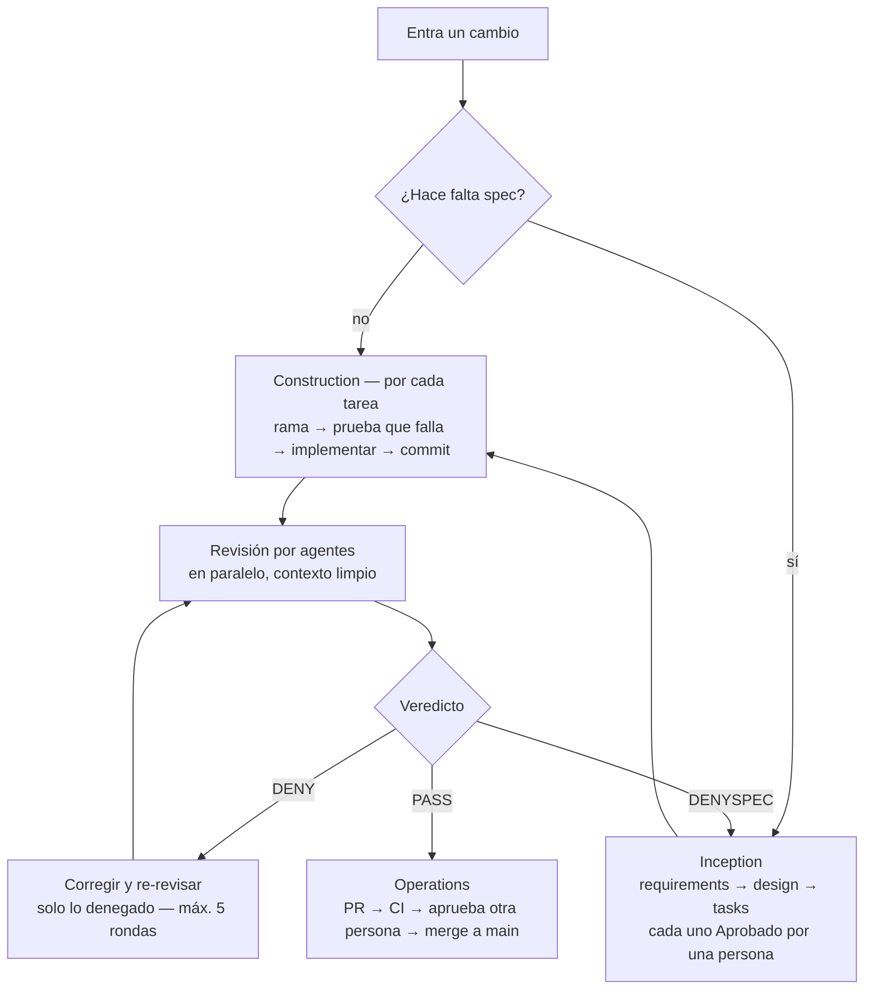

# Metodología AI-DLC de GrupoTX

> Transcripción fiel a markdown del PDF `2026-08-12_metodologia-aidlc-grupotx-v0.2.0.pdf` (versión 0.2.0, 12 ago 2026), para poder editar y versionar el contenido en el repo. No se cambió una palabra.

## 1. Qué es esto (y qué no es)

| Es | No es |
|---|---|
| El método interno: cómo nuestro equipo construye software con IA, de la idea al merge en main | Un proceso para clientes externos — eso son los kits hermanos (Quick, AI Maturity) |
| Basado en AWS AI-DLC: conserva sus fases y vocabulario, e inserta nuestras prácticas y herramientas en cada paso | Una copia del workflow de AWS: donde AWS no dice nada (revisión por agentes, enforcement, medidas), ponemos lo nuestro |
| Un documento único, corto y versionado | Un sitio de decenas de páginas con estructura de kit comercial |
| La referencia contra la que se responde "¿tenemos una metodología?" (sección 11) | Documentación de las herramientas — cada herramienta documenta la suya; aquí solo se apunta (sección 7) |

Existe por tres razones: que todos los desarrolladores trabajen igual, que como AWS Partner podamos evidenciar un método propio basado en el de AWS, y que el método mejore con datos (post-mortems y medidas alimentan cambios a este documento).

## 2. El ciclo en una vista

AWS AI-DLC propone tres fases: en Inception la IA convierte la intención de negocio en especificaciones y plan; en Construction la IA construye en unidades cortas (Bolts — horas o días, no semanas) con supervisión humana constante; en Operations se despliega y se opera. Nuestro método conserva esa espina:

| Fase AWS | Qué propone AWS | Nuestra práctica | Sección |
|---|---|---|---|
| Inception | Mob Elaboration: la IA propone requisitos, historias y diseño; el equipo decide | ¿Hace falta spec? Si sí: exploración → requirements.md → design.md → tasks.md, cada uno con Aprobado de una persona | 4 |
| Construction | Bolts con Mob Construction: la IA implementa, los humanos supervisan | Una tarea = una rama + un PR; TDD; revisión por agentes con veredicto; merge siempre humano | 5 |
| Operations | Despliegue y operación asistidos por IA | CI en el PR, publicación, post-mortems numerados, feedback al método | 6 |

La regla central del flujo [Propuesto]: en todo el recorrido el desarrollador invoca una sola cosa a mano (pedir la revisión). Todo lo demás se activa solo (skills), lo dispara el paso anterior (agentes) o es mecánico (hooks y CI). Un método que depende de que alguien se acuerde de cada paso no es un método.

## 3. Las cuatro capas

Toda práctica del método vive en una de estas capas. La capa define cómo se activa y cuánto cuesta incumplirla:

| Capa | Qué es | Cómo se activa | Qué existe hoy |
|---|---|---|---|
| Estándar | El canon normativo: reglas de estilo, convenciones, políticas | Los agentes y las personas lo cargan como contexto; no se ejecuta | [Real] reglas por repo en `.claude/rules/` (python-style, terraform-patterns, testing, convenciones-kb); política de gobernanza de IA (regla §13.5, sección 8) |
| Skill | Instrucciones empaquetadas que el modelo carga solo cuando la tarea coincide | Se activa sola | [Real] 8 skills de Claude Code repartidas entre repos (sección 7) · [Propuesto] la familia unificada grupotx-* (onboarding, exploración, ejecución, tdd, api, testing, recibir-revisión) |
| Agente | Revisor o ejecutor despachado con contexto limpio; cuando revisa, es de solo lectura | Lo despacha el flujo, no una persona | [Real] personas revisoras de Forge (developer, qa, security) con veredicto · [Propuesto] panel de agentes por dominio en paralelo |
| Enforcement | Mecánico: hooks de git y checks de CI; no depende de que nadie se acuerde | Siempre, sin excepción manual silenciosa | [Real] definiciones de CI por stack (ci-design para dotnet/ts/py, go, terraform) y test gate · [Propuesto] guard de git (sin `--no-verify`, sin `push --force`; escotilla solo con motivo escrito) y escaneo de secretos previo a toda revisión |

Regla de capas: si una regla importa de verdad, se baja de Estándar a Enforcement. Lo que solo vive en un documento acaba incumpliéndose; lo que vive en un hook o en CI, no.

## 4. Inception — decidir y especificar

### 4.1 ¿Hace falta spec?

En duda, no hagas spec. Solo hace falta si el cambio cumple al menos una [Propuesto — criterios por confirmar]:

- cambia un flujo de negocio,
- toca más de un componente,
- dura más de 2 días, o
- es una decisión automatizada sobre una persona (GenAI con impacto en personas).

Si no cumple ninguna, basta el ticket: el cambio entra directo a Construction (sección 5). Este es nuestro equivalente ligero de los "alcances adaptativos" de AWS v2 (poc/mvp/feature/enterprise/bugfix): en vez de clasificar el proyecto, se decide por cambio cuánta ceremonia merece.

### 4.2 La secuencia de spec

Tres artefactos, en orden, cada uno con Aprobado explícito de una persona antes de pasar al siguiente. No se escribe código de producción antes del diseño aprobado.

| Artefacto | Qué contiene | Quién aprueba |
|---|---|---|
| requirements.md | Qué se necesita y por qué; criterios de aceptación | Quien pidió el cambio |
| design.md | Cómo se va a construir; decisiones y alternativas descartadas. Si el cambio es GenAI: evaluación de riesgo (TM-30) y nivel de autonomía A0–A3 [Propuesto — escala por definir] | Tech lead |
| tasks.md | La descomposición en tareas; cada tarea debe caber en un Bolt (sección 5) | Quien va a construir |

En vocabulario AWS: los tres artefactos aprobados son nuestro paquete de Inception; cada entrada de tasks.md es una Unit of Work; y la sesión donde el equipo revisa y corrige los artefactos en vivo es la Mob Elaboration [Propuesto — hoy la aprobación es asíncrona; la sesión en vivo no es práctica confirmada]. La exploración previa (entender el código existente antes de proponer) es el paso 2.1 de AWS v2 y es especialmente obligatoria en brownfield.

## 5. Construction — construir en Bolts

El Bolt es la unidad de construcción de AWS v1: corta, con resultado demostrable. En nuestro método:

**Un Bolt = una tarea de tasks.md = una rama + un PR revisable.**

Reglas de tamaño [Propuesto — umbrales por confirmar con los primeros ciclos]: la rama vive máximo 3 días; el PR apunta a menos de 200 líneas cambiadas y 10 ficheros (tope absoluto 400 y 20 — un PR enorme no se revisa, se aprueba a ciegas, y eso no es revisión).

### 5.1 El loop dentro del Bolt

1. Rama por tarea: `feat/tkt-NN-descripcion-corta`.
2. Una tarea a la vez, con bitácora — qué se intentó, qué falló, qué quedó [Propuesto como skill de ejecución].
3. TDD: escribir la prueba que falla — y verla fallar — antes de implementar [Propuesto].
4. Implementar hasta que la prueba pase.
5. Commit con convención (`feat(api): filtro por estado`); el guard de git vigila las reglas mecánicas [Propuesto].

### 5.2 Revisión por agentes

- Antes de leer nada, escaneo de secretos del diff. Si hay un secreto: es un incidente — se rota la credencial primero, después se sigue [Propuesto como paso automático; la regla de rotar-primero es política ya].
- Los agentes revisan en paralelo, cada uno en contexto limpio (sin la conversación del implementador, para que no hereden sus supuestos). [Real] en Forge con las personas developer/qa/security; el panel por dominios (lógica-QA, rendimiento-fiabilidad, seguridad-cumplimiento, equidad de IA, estándares de proceso, y uno de harness solo si el cambio toca el propio harness) es [Propuesto].
- El veredicto no es una nota. Cada hallazgo se clasifica por gravedad; con algo Crítico o Alto el veredicto global es DENY (bloquea). Sin eso, PASS. DENYSPEC significa que el problema está en la spec, no en el código: el hallazgo vuelve a Inception (sección 4), no al implementador. [Real — PASS/DENY/DENYSPEC es la salida real de Forge.]
- Corregir → re-revisar solo lo denegado. Máximo 5 rondas de arreglar-y-volver-a-revisar [Propuesto]; después de la 5.ª, la decisión pasa a una persona (se adjudica como portante o se aparca con motivo). En la ronda 4 o superior: cambiar de implementador — contexto limpio y modelo más capaz, porque insistir con el mismo contexto repite el mismo error.

### 5.3 Gate de Bolt (cierre)

Un Bolt cierra cuando, con veredicto PASS, lo aprueba alguien que no sea su autor y el merge a main lo hace una persona identificable. Esto es la regla §13.5 de la política de gobernanza de IA [Real — política vigente] y no admite excepción: ningún agente hace merge, nunca.

## 6. Operations — publicar y aprender

- Publicación: push + PR (`gh pr create`); el CI del proyecto revisa mecánicamente tamaño del PR, cobertura de pruebas y formato [Real las definiciones ci-design por stack; Propuestos los umbrales — sección 8]. Merge a main → despliegue según el pipeline de cada proyecto.
- Post-mortems numerados [Real — práctica establecida en Forge]: toda escalación (5 rondas agotadas), incidente o sorpresa relevante produce un post-mortem corto con número correlativo. No es burocracia: sus conclusiones se convierten en cambios concretos de Estándar, Skill o Enforcement.
- El método se versiona: los cambios a este documento se registran en el historial (al final) con fecha y motivo. La fuente de los cambios son los post-mortems y las medidas — el método mejora con evidencia, no con opiniones.

## 7. Caja de herramientas

La metodología apunta, no duplica: cada herramienta mantiene su propia documentación. Esta tabla es el inventario y su estado real a 2026-08-12.

| Herramienta | Qué aporta al ciclo | Estado | Dónde vive su doc |
|---|---|---|---|
| Harness GrupoTX (comandos grupotx-*, panel de agentes, guard de git, plugin) | El flujo de un cambio encadenado de punta a punta con una sola invocación manual | [Propuesto] — es la visión a construir; hoy no existe como plugin. Su boceto es el diagrama "El flujo de un cambio en el harness GrupoTX" | Por crear, junto con el harness |
| Claude Code + skills | Ejecución de tareas; skills que se activan solas por dominio | [Real] — 8 skills repartidas entre repos: ari-tramite-api; prep-1on1, close-1on1, generate-okrs; vercel-react-best-practices, web-design-guidelines (y un directorio de skills vacío en SDAP) | El `.claude/skills/` de cada repo |
| Reglas (`.claude/rules/`) | El Estándar que cargan agentes y personas | [Real] — python-style, terraform-patterns, testing (SDAP); convenciones-kb (Grupo TX) | El `.claude/rules/` de cada repo |
| Forge | Orquestación de corridas autónomas con revisores y veredicto PASS/DENY/DENYSPEC | [Real] — repo forge: personas developer/qa/security, 13 changelogs numerados, post-mortems run8–run20 | Repo forge: docs/architecture.md, docs/overview.md |
| Kiro | Specs (requirements/design/tasks) y steering por repo | Producto real; su uso dentro del método está [Propuesto] — por confirmar | Documentación oficial de Kiro |
| CI (ci-design + test gate) | Enforcement mecánico en el PR | [Real] — definiciones por stack: dotnet/ts/py, go, terraform | Repo Marco: `.claude/ci-design/` y el brief del test gate |

Nota de exactitud sobre Forge [Real]: Forge corre sobre Strands Agents SDK + temporal.io + Amazon Bedrock, desplegado en ECS Fargate / EC2 efímero. Ningún material del método (ni interno ni comercial) debe afirmar que corre sobre AgentCore mientras eso no sea cierto; si la arquitectura evoluciona, se actualiza esta fila primero.

## 8. Gobernanza y medidas

La regla de oro — §13.5 de la política de gobernanza de IA [Real — política vigente]:

> Todo código generado por IA pasa revisión humana antes de integrarse. El merge lo ejecuta siempre una persona identificable.

La responsabilidad (Accountable) de cada cambio recae siempre en una persona con nombre; ningún agente es Accountable de nada, nunca.

Las medidas del método [Propuesto — umbrales por confirmar con datos de los primeros ciclos; hasta entonces no se reportan como vigentes]:

| Medida | Umbral propuesto | Dónde se mide |
|---|---|---|
| Tamaño del PR | Objetivo: <200 líneas y <10 ficheros · tope: 400 / 20 | CI |
| Cobertura de pruebas | Mínimo 75% de ramas y 80% de líneas | CI |
| Rondas de revisión | Máximo 5; en la ronda ≥4, cambio de implementador | Harness |
| Veredicto | Hallazgo Crítico o Alto → DENY; no hay puntaje | Agentes revisores |

Regla de medidas: una medida sin instrumentación automática no se reporta — se marca [Propuesto] y punto. Reportar a mano lo que no se mide es teatro.

## 9. Mapa AWS AI-DLC ↔ práctica GrupoTX

La trazabilidad con el método de AWS, para nosotros y para evidenciarlo como partner:

| AWS AI-DLC | Nuestro equivalente | Estado |
|---|---|---|
| Fases Inception / Construction / Operations (v1) | Secciones 4, 5 y 6 de este documento | [Real] como estructura del método |
| Mob Elaboration (v1) | Sesión en vivo de aprobación de requirements/design/tasks | [Propuesto] — hoy la aprobación es asíncrona |
| Mob Construction (v1) | Trabajo por tarea con bitácora y demo en el PR | [Propuesto] |
| Bolt (v1) | Una tarea = una rama + un PR revisable, vida máxima 3 días | [Real] el trabajo por PR · [Propuesto] las reglas de tamaño |
| Unit of Work (v2) | Entrada de tasks.md | [Propuesto] como formato unificado (Forge ya trabaja con specs) |
| Etapas 2.x con artefactos y aprobación (v2) | requirements.md → design.md → tasks.md, cada uno Aprobado por una persona | [Propuesto] como flujo unificado; [Real] por partes en Forge (specs/) |
| Alcances adaptativos poc/mvp/feature/enterprise/bugfix (v2) | La decisión "¿hace falta spec?" por cambio (sección 4.1) | [Propuesto] |
| Verification gates (v2) | Veredicto PASS/DENY/DENYSPEC + aprobación ajena + merge humano (§13.5) | [Real] — Forge y política vigente |
| AI Pod de 2-3 personas (v1) | Por definir según el tamaño real del equipo | [Propuesto] |

Fuentes: blog de AWS AI-Driven Development Life Cycle (v1) y repo awslabs/aidlc-workflows (v2).

## 10. Convenciones y glosario mínimo

- AI-DLC siempre con guion. Quedan en inglés los términos acuñados por AWS sin equivalente asentado y los valores literales de sistemas; se traduce el resto.
- Sin emojis en ningún material del método (✓ ✗ — permitidos).
- Español narrativo; nombres de producto en su forma oficial.

| Término | Forma | Qué es |
|---|---|---|
| AI-DLC | Con guion, "el AI-DLC" | El ciclo de vida de desarrollo dirigido por IA (AWS) |
| Bolt | Inglés, "el Bolt" | Unidad corta de construcción: una tarea = una rama + un PR |
| Unit of Work (UoW) | Inglés | Una entrada de tasks.md; cabe en un Bolt |
| Mob Elaboration | Inglés | Sesión en vivo donde el equipo corrige la spec propuesta por la IA |
| spec | Minúscula | El paquete requirements + design + tasks |
| PASS / DENY / DENYSPEC | Mayúsculas, inglés | Veredicto de revisión; DENYSPEC = el problema está en la spec, vuelve a Inception |
| harness | Minúscula | El conjunto skills + agentes + enforcement que encadena el flujo |
| skill | Minúscula, "la skill" | Instrucciones que el modelo carga solo cuando la tarea coincide |
| escotilla | Español | Excepción manual al guard, siempre con motivo escrito (≥20 caracteres) |
| post-mortem | Con guion | Análisis corto y numerado tras escalación o incidente; alimenta cambios al método |

## 11. ¿Tenemos una metodología?

La pregunta se responde con esta checklist — sin evidencia archivada no hay ✓, aunque todos sepan que se hizo:

| # | Criterio | Evidencia exigida | Hoy |
|---|---|---|---|
| M1 | Documento del método vigente y versionado | Este README con historial | ✓ |
| M2 | Inventario de herramientas real, sin aspiracional sin marcar | Sección 7 con estados [Real]/[Propuesto] | ✓ |
| M3 | El flujo de un cambio existe de punta a punta (harness operativo) | Skills, agentes y hooks instalados y usados en ≥1 repo | ✗ |
| M4 | ≥1 proyecto real completó un ciclo entero bajo el método | PRs con veredictos, aprobación ajena y merge humano rastreables | ✗ — Forge se acerca (corridas reales con veredicto y post-mortems), pero no el flujo spec→PR completo de este documento |
| M5 | Los gates operan: no existe vía de merge sin persona | Auditoría del historial de git | ✗ — por auditar |
| M6 | Las medidas se miden solas | CI reportando tamaño y cobertura en cada PR | ✗ |

Veredicto a 2026-08-12: EN CONSTRUCCIÓN. El método será REAL cuando M3–M6 tengan evidencia. Esta tabla se re-evalúa en cada versión del documento.

## 12. Pendientes

1. Confirmar el flujo real contra el diagrama del harness: decidir qué se construye tal cual, qué cambia y qué se descarta (comandos grupotx-*, panel de agentes por dominio, guard de git, escaneo de secretos previo, tope de 5 rondas, cambio de implementador).
2. Construir el harness como plugin instalable y unificar bajo él las 8 skills hoy dispersas por repos.
3. Definir TM-30 y la escala de autonomía A0–A3 para cambios GenAI (hoy solo nombradas en el diseño propuesto).
4. Confirmar los umbrales (tamaño de PR, cobertura, rondas) con datos de los primeros ciclos medidos.
5. Alinear el material comercial de Forge con su arquitectura real (Strands + temporal.io + Bedrock; no AgentCore).
6. Decidir el hogar definitivo de este documento: repo propio o docs/ del futuro harness (está escrito para poder moverse sin cambios).

## Historial

| Versión | Fecha | Cambio |
|---|---|---|
| 0.2.0 | 2026-08-12 | Reescritura completa: de kit de 33 documentos con formato de cliente a documento único interno. Se incorpora la visión del harness (cuatro capas, flujo de un cambio) con marcadores [Real]/[Propuesto]. |
| 0.1.0 | 2026-08-11 | Esqueleto inicial con formato de kit (descartado). |

## Referencias

- AWS, blog: AI-Driven Development Life Cycle — fases, Bolts, Mob Elaboration/Construction, AI Pods (v1).
- AWS, repo: awslabs/aidlc-workflows — etapas, artefactos, gates y alcances adaptativos (v2).
- Política de gobernanza de IA de GrupoTX, regla §13.5 (revisión humana y merge humano).
- Diagrama "El flujo de un cambio en el harness GrupoTX" — boceto de la visión, no confirmado (archivo flujo-harness.png en el workspace de metodologías).
